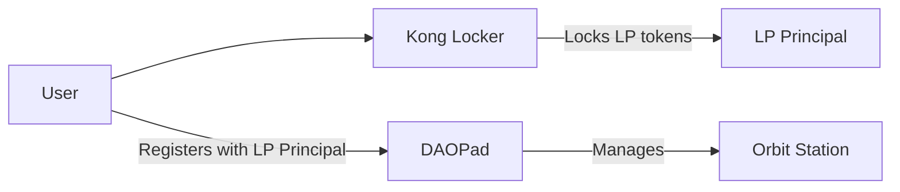

# CLAUDE.md - Repository Overview

This repository contains two **independent but related** projects that share deployment infrastructure. Each project has its own CLAUDE.md file with specific guidance.

## 🎯 Project Selection Guide

### Work on DAOPad (`src/daopad/`) when:
- User mentions: governance, voting, proposals, Orbit Station, Alexandria DAO
- Tasks involve: admin operations, DAO integration, treasury management
- Keywords: daopad_backend, daopad_frontend, orbit_station

### Work on Kong Locker (`src/kong_locker/`) when:
- User mentions: LP tokens, liquidity locking, KongSwap, konglocker.org
- Tasks involve: tracking locked positions, LP token management
- Keywords: kong_locker, kong_locker_frontend, Kong

**IMPORTANT**: These projects are architecturally separate. Changes in one should NOT require changes in the other unless explicitly working on their integration point (registration system).

## 🏗️ Shared Infrastructure

### Deployment
Both projects deploy through a unified system:
```bash
./deploy.sh --network ic              # Deploy everything
./deploy.sh --network ic --backend-only   # Backend canisters only
./deploy.sh --network ic --frontend-only  # Frontend canisters only
```

### Identity Management
```bash
# For deployments, Claude can now use:
dfx identity use daopad  # No password required, Claude can deploy with this

# User's primary identity (password-protected):
dfx identity use alex    # Password required, only user can use
```

### Project Structure
```
src/
├── daopad/           # See src/daopad/CLAUDE.md
│   ├── daopad_backend/
│   ├── daopad_frontend/
│   └── orbit_station/
├── kong_locker/      # See src/kong_locker/CLAUDE.md
│   ├── kong_locker/
│   └── kong_locker_frontend/
└── declarations/     # Auto-generated, DO NOT EDIT
```

## ⚠️ Critical Rules

1. **Claude CAN NOW deploy to mainnet** - Use `dfx identity use daopad` then `./deploy.sh --network ic`
2. **NEVER use local development** - Everything deploys to mainnet IC
3. **ALWAYS use mainnet** for testing (no local dfx)
4. **DO NOT modify** declarations folder
5. **RESPECT project boundaries** - Work within the appropriate project folder

## 🔗 Project Relationship



Kong Locker provides the **proof of liquidity** (LP Principal) that DAOPad uses for **governance rights**.

## 📦 Canister IDs (Mainnet)

| Project | Canister | ID |
|---------|----------|-----|
| DAOPad | Backend | `lwsav-iiaaa-aaaap-qp2qq-cai` |
| DAOPad | Frontend | `l7rlj-6aaaa-aaaaa-qaffq-cai` |
| Kong Locker | Backend | `eazgb-giaaa-aaaap-qqc2q-cai` |
| Kong Locker | Frontend | `c6w56-taaaa-aaaai-atlma-cai` |
| External | Orbit Station | `fec7w-zyaaa-aaaaa-qaffq-cai` |

## 🚀 Quick Commands

```bash
# Build specific backend
cargo build --target wasm32-unknown-unknown --release -p daopad_backend --locked
cargo build --target wasm32-unknown-unknown --release -p kong_locker --locked

# Extract candid (ALWAYS after Rust changes)
candid-extractor target/wasm32-unknown-unknown/release/daopad_backend.wasm > src/daopad/daopad_backend/daopad_backend.did
candid-extractor target/wasm32-unknown-unknown/release/kong_locker.wasm > src/kong_locker/kong_locker/kong_locker.did

# Test canisters
dfx canister --network ic call daopad_backend get_backend_principal
dfx canister --network ic call kong_locker get_all_voting_powers
```

## 📚 Project-Specific Documentation

- **DAOPad Details**: See `src/daopad/CLAUDE.md`
- **Kong Locker Details**: See `src/kong_locker/CLAUDE.md`

## 🔴 Common Pitfalls

1. **Password prompts**: Deployment requires manual password entry for alex identity
2. **Query limitations**: Inter-canister query calls don't work (IC limitation)
3. **Remote config**: Never add `remote` field in dfx.json (breaks deployment)
4. **Workspace confusion**: These are Rust workspaces, not npm workspaces

## For Claude Code

When starting work:
1. Identify which project the task relates to
2. Navigate to the appropriate CLAUDE.md for detailed guidance
3. Stay within project boundaries unless explicitly integrating
4. **Deploy changes**: Switch to `daopad` identity and run deployment commands:
   ```bash
   dfx identity use daopad
   ./deploy.sh --network ic
   ```