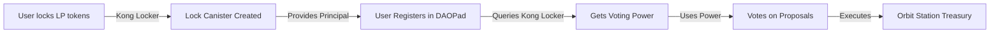

# CLAUDE.md - DAOPad Development Guide

## 🎯 IMPORTANT: New Workflow as of December 2024

**This is now the PRIMARY working directory.** All active development happens in DAOPad. Kong Locker is feature-complete and should only be accessed for read-only operations to understand voting power allocation.

### Key Changes:
1. **Focus**: All development work is now on DAOPad (governance and voting)
2. **Kong Locker**: READ-ONLY - Used only to understand locked liquidity voting power
3. **Deployment**: Use `./deploy.sh` from THIS directory (`src/daopad/`), NOT the root
4. **Documentation**: This CLAUDE.md is now the main guide (root CLAUDE.md removed)

### Workflow Summary:
```bash
# You are here: src/daopad/
pwd  # Should show: /path/to/project/src/daopad/

# Deploy DAOPad changes (use local deploy script)
./deploy.sh --network ic              # Deploy everything
./deploy.sh --network ic --backend-only   # Backend only
./deploy.sh --network ic --frontend-only  # Frontend only

# Need reference info? (ALL READ-ONLY)
# Kong Locker: ../kong_locker/CLAUDE.md
# Orbit Station: ./orbit-reference/ (Dfinity's official repo)
# Never modify reference code
```

## 📁 Repository Structure

```
project_root/
├── deploy.sh            # LEGACY - Archived, DO NOT USE
├── src/
│   ├── daopad/         # YOU ARE HERE - Primary development
│   │   ├── CLAUDE.md   # This file - Main documentation
│   │   ├── deploy.sh   # USE THIS for deployments
│   │   ├── daopad_backend/
│   │   ├── daopad_frontend/
│   │   ├── orbit_station/
│   │   └── orbit-reference/  # READ-ONLY - Dfinity Orbit source (reference only)
│   │       ├── apps/station/  # Station frontend code (for reference)
│   │       ├── core/station/  # Station backend code (for reference)
│   │       └── ...           # Full Orbit codebase (DO NOT MODIFY)
│   │
│   └── kong_locker/    # READ-ONLY - Reference only
│       ├── CLAUDE.md   # Kong Locker details (for reference)
│       ├── deploy.sh   # Kong Locker deploy (rarely used)
│       ├── kong_locker/
│       └── kong_locker_frontend/
```

## 🔗 Understanding the Integration

### Voting Power Flow


### When You Need Reference Information:
- **Kong Locker voting power**: Read `../kong_locker/CLAUDE.md`
- **Orbit Station architecture**: Read `./orbit-reference/` files
- **Treasury management patterns**: See `orbit-reference/apps/station/`
- **Station backend logic**: See `orbit-reference/core/station/`
- **But remember**: NEVER modify reference code - it's READ-ONLY

### Kong Locker Key Concepts (Reference Only):
- Users lock LP tokens permanently in individual canisters
- Each user gets one lock canister (blackholed, immutable)
- Voting power = USD value of locked LP tokens × 100
- Query with: `dfx canister --network ic call kong_locker get_all_voting_powers`

## 🏛️ DAOPad Architecture (Active Development)

### Core Components
```
daopad/
├── daopad_backend/       # Rust canister - governance logic
│   ├── src/
│   │   ├── lib.rs       # Main entry point
│   │   ├── alexandria_dao.rs  # Orbit Station integration
│   │   └── types.rs     # Type definitions
│   └── daopad_backend.did  # Auto-generated candid
│
├── daopad_frontend/      # React app - voting interface
│   ├── src/
│   │   ├── App.jsx      # Main application
│   │   └── components/  # UI components
│   └── dist/            # Build output
│
└── orbit_station/        # Orbit Station interfaces
    └── orbit_station.did # For cross-canister calls
```

### Development Workflow

#### Backend Changes
```bash
# 1. Make Rust changes
cd daopad_backend
vim src/lib.rs

# 2. Build (from project root)
cd ../..  # Back to project root
cargo build --target wasm32-unknown-unknown --release -p daopad_backend --locked

# 3. Extract candid
candid-extractor target/wasm32-unknown-unknown/release/daopad_backend.wasm > src/daopad/daopad_backend/daopad_backend.did

# 4. Deploy (from src/daopad/)
cd src/daopad
./deploy.sh --network ic --backend-only
```

#### Frontend Changes
```bash
# 1. Development server
cd daopad_frontend
npm install
npm run dev  # localhost:3000

# 2. Deploy
cd ..  # Back to src/daopad/
./deploy.sh --network ic --frontend-only
```

## 🔑 Key Integration Points

### With Kong Locker (READ-ONLY)
```rust
// Users provide their Kong Locker principal as proof
register_with_lp_principal(kong_locker_principal: Principal) {
    // DAOPad verifies this principal owns a lock canister
    // Queries Kong Locker for voting power calculation
    // Grants governance rights based on locked amount
}

// Getting voting power (reference only)
get_voting_power(user: Principal) -> u64 {
    // Internally queries Kong Locker's data
    // Returns USD value * 100 of locked LP tokens
}
```

### With Orbit Station (ACTIVE DEVELOPMENT)
```rust
// DAOPad backend acts as the DAO admin for Orbit Station
impl OrbitAdmin for DaoPadBackend {
    // Execute treasury operations after DAO approval
    async fn execute_request(request_id: u64) -> Result<()>
}
```

## ⚠️ Critical Limitations

### Query Method Restriction (IC Platform Limitation)
```rust
// ❌ DOESN'T WORK - Query methods can't call other queries
#[query]
async fn get_orbit_data() -> Result<Data> {
    orbit_station.list_requests().await // FAILS!
}

// ✅ WORKS - Update methods can call anything
#[update]
async fn execute_orbit_action() -> Result<()> {
    orbit_station.execute_request().await // Works!
}
```

## 📝 Active Development Areas

### Current Focus
- [ ] Proposal creation interface
- [ ] Vote tallying mechanisms
- [ ] Orbit Station integration
- [ ] Treasury management UI
- [ ] Governance analytics dashboard

### Backend Methods (Actively Developed)
```rust
// User Management
register_with_lp_principal(principal: Principal) -> Result<()>
get_voting_power(user: Principal) -> Result<u64>
get_user_status(user: Principal) -> Result<UserStatus>

// Voting System
create_proposal(proposal: ProposalInput) -> Result<u64>
cast_vote(proposal_id: u64, vote: Vote) -> Result<()>
execute_proposal(proposal_id: u64) -> Result<()>

// Orbit Integration
sync_with_orbit_station() -> Result<()>
get_treasury_status() -> Result<TreasuryStatus>
```

## 🚀 Deployment

### Identity Management
```bash
# For deployments, Claude uses:
dfx identity use daopad  # No password required

# User's identity (password-protected):
dfx identity use alex    # Manual password entry
```

### Deployment Commands (from src/daopad/)
```bash
# Full deployment
./deploy.sh --network ic

# Backend only
./deploy.sh --network ic --backend-only

# Frontend only  
./deploy.sh --network ic --frontend-only

# Fresh deployment (local only)
./deploy.sh --fresh
```

## 📦 Canister IDs

| Component | Canister ID | URL |
|-----------|-------------|-----|
| DAOPad Backend | `lwsav-iiaaa-aaaap-qp2qq-cai` | - |
| DAOPad Frontend | `l7rlj-6aaaa-aaaaa-qaffq-cai` | https://l7rlj-6aaaa-aaaaa-qaffq-cai.icp0.io |
| Orbit Station | `fec7w-zyaaa-aaaaa-qaffq-cai` | External |
| Kong Locker | `eazgb-giaaa-aaaap-qqc2q-cai` | Reference only |

## 🔴 Common Issues

| Issue | Solution |
|-------|----------|
| "Backend not authorized" | Register backend principal in Orbit Station |
| "Invalid candid decode" | Run candid-extractor after Rust changes |
| "Query calling query" | Use update method or direct frontend call |
| Need Kong Locker data | Read `../kong_locker/CLAUDE.md` for API info |
| Wrong deploy script | Use `./deploy.sh` from THIS directory |

## 📚 Quick Reference

### Testing Commands
```bash
# DAOPad operations
dfx canister --network ic call daopad_backend get_backend_principal
dfx canister --network ic call daopad_backend get_cache_status
dfx canister --network ic call daopad_backend get_alexandria_proposals

# Kong Locker queries (READ-ONLY reference)
dfx canister --network ic call kong_locker get_all_voting_powers
dfx canister --network ic call kong_locker get_total_value_locked
```

## For Claude Code

### Primary Rules:
1. **Work in DAOPad** - This is the active development area
2. **Reference repositories are READ-ONLY** - Never modify Kong Locker or Orbit reference code
3. **Use local deploy.sh** - Always deploy from `src/daopad/` directory
4. **Extract candid** - After every Rust change
5. **Test on mainnet** - No local testing, deploy directly to IC

### Reference Repository Usage:

#### Kong Locker Reference (../kong_locker/):
- Navigate to `../kong_locker/CLAUDE.md`
- Understand voting power calculation
- Reference API documentation
- **Never modify Kong Locker code**

#### Orbit Reference (./orbit-reference/):
- **🚨 CRITICAL**: This is Dfinity's official Orbit repository - READ-ONLY
- Use for understanding Station architecture: `orbit-reference/core/station/`
- Study frontend patterns: `orbit-reference/apps/station/`
- Reference treasury management: `orbit-reference/core/station/src/services/`
- Check API interfaces: `orbit-reference/core/station/api/`
- **🚨 NEVER MODIFY - This is not our code, it's reference material only**

### Workflow Checklist:
- [ ] Currently in `src/daopad/` directory
- [ ] Using `./deploy.sh` (not root deploy.sh)
- [ ] All reference repositories treated as read-only
- [ ] Candid extracted after Rust changes
- [ ] Focusing on governance/voting features
- [ ] Using Orbit patterns without copying code directly

### When You Need Reference Information:
1. **Voting Power Logic**: Read Kong Locker reference
2. **Station Architecture**: Study `orbit-reference/core/station/src/`
3. **Treasury Patterns**: Check `orbit-reference/apps/station/src/`
4. **API Design**: Reference `orbit-reference/core/station/api/`
5. **Frontend Structure**: Study `orbit-reference/apps/station/frontend/`

Remember: DAOPad is where we build. References are where we learn. Never modify reference code.