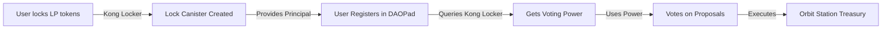

# CLAUDE.md - DAOPad Development Guide

## 🎯 IMPORTANT: New Workflow as of December 2024

**This is now the PRIMARY working directory.** All active development happens in DAOPad. Kong Locker is feature-complete and should only be accessed for read-only operations to understand voting power allocation.

### Key Changes:
1. **Focus**: All development work is now on DAOPad (governance and voting)
2. **Kong Locker**: READ-ONLY - Used only to understand locked liquidity voting power
3. **Deployment**: Use `./deploy.sh` from THIS directory (`src/daopad/`), NOT the root
4. **Documentation**: This CLAUDE.md is now the main guide (root CLAUDE.md removed)

### Workflow Summary:
```bash
# You are here: src/daopad/
pwd  # Should show: /path/to/project/src/daopad/

# Deploy DAOPad changes (use local deploy script)
./deploy.sh --network ic              # Deploy everything
./deploy.sh --network ic --backend-only   # Backend only
./deploy.sh --network ic --frontend-only  # Frontend only

# Need reference info? (ALL READ-ONLY)
# Kong Locker: ../kong_locker/CLAUDE.md
# Orbit Station: ./orbit-reference/ (Dfinity's official repo)
# Never modify reference code
```

## 📁 Repository Structure

```
project_root/
├── deploy.sh            # LEGACY - Archived, DO NOT USE
├── src/
│   ├── daopad/         # YOU ARE HERE - Primary development
│   │   ├── CLAUDE.md   # This file - Main documentation
│   │   ├── deploy.sh   # USE THIS for deployments
│   │   ├── daopad_backend/
│   │   ├── daopad_frontend/
│   │   ├── orbit_station/
│   │   └── orbit-reference/  # READ-ONLY - Dfinity Orbit source (reference only)
│   │       ├── apps/station/  # Station frontend code (for reference)
│   │       ├── core/station/  # Station backend code (for reference)
│   │       └── ...           # Full Orbit codebase (DO NOT MODIFY)
│   │
│   └── kong_locker/    # READ-ONLY - Reference only
│       ├── CLAUDE.md   # Kong Locker details (for reference)
│       ├── deploy.sh   # Kong Locker deploy (rarely used)
│       ├── kong_locker/
│       └── kong_locker_frontend/
```

## 🔗 Understanding the Integration

### Voting Power Flow


### When You Need Reference Information:
- **Kong Locker voting power**: Read `../kong_locker/CLAUDE.md`
- **Orbit Station architecture**: Read `./orbit-reference/` files
- **Treasury management patterns**: See `orbit-reference/apps/station/`
- **Station backend logic**: See `orbit-reference/core/station/`
- **But remember**: NEVER modify reference code - it's READ-ONLY

### Kong Locker Key Concepts (Reference Only):
- Users lock LP tokens permanently in individual canisters
- Each user gets one lock canister (blackholed, immutable)
- Voting power = USD value of locked LP tokens × 100
- Query with: `dfx canister --network ic call kong_locker get_all_voting_powers`

## 🏛️ DAOPad Architecture (Active Development)

### Core Components
```
daopad/
├── daopad_backend/       # Rust canister - governance logic
│   ├── src/
│   │   ├── lib.rs       # Main entry point
│   │   ├── alexandria_dao.rs  # Orbit Station integration
│   │   └── types.rs     # Type definitions
│   └── daopad_backend.did  # Auto-generated candid
│
├── daopad_frontend/      # React app - voting interface
│   ├── src/
│   │   ├── App.jsx      # Main application
│   │   └── components/  # UI components
│   └── dist/            # Build output
│
├── orbit_station/        # Orbit Station interface (KEEP THIS!)
│   └── orbit_station.did # Candid interface for cross-canister calls to Orbit
│                        # This defines the API contract between DAOPad and Orbit Station
│                        # Required for backend to interact with treasury operations
│
└── orbit-reference/      # Full Orbit source code (reference only, DO NOT MODIFY)
```

### Development Workflow

#### Making Changes
```bash
# Backend changes
cd daopad_backend
vim src/lib.rs

# Frontend changes
cd daopad_frontend
vim src/components/SomeComponent.jsx

# Build backend if Rust changed (from project root)
cd ../..  # Back to project root
cargo build --target wasm32-unknown-unknown --release -p daopad_backend --locked

# Extract candid if Rust changed
candid-extractor target/wasm32-unknown-unknown/release/daopad_backend.wasm > src/daopad/daopad_backend/daopad_backend.did
```

#### ALWAYS DEPLOY TO MAINNET AFTER CHANGES
```bash
# From src/daopad/ directory
cd src/daopad
./deploy.sh --network ic  # Deploys both backend and frontend

# Note: The --backend-only and --frontend-only flags exist but we typically deploy everything
```

**⚠️ CRITICAL: Always deploy to mainnet using `./deploy.sh --network ic` after making ANY changes. There is no local testing environment - all testing happens on mainnet. This ensures both frontend and backend stay in sync.**

## 🔑 Key Integration Points

### With Kong Locker (READ-ONLY)
```rust
// Users provide their Kong Locker principal as proof
register_with_lp_principal(kong_locker_principal: Principal) {
    // DAOPad verifies this principal owns a lock canister
    // Queries Kong Locker for voting power calculation
    // Grants governance rights based on locked amount
}

// Getting voting power (reference only)
get_voting_power(user: Principal) -> u64 {
    // Internally queries Kong Locker's data
    // Returns USD value * 100 of locked LP tokens
}
```

### With Orbit Station (ACTIVE DEVELOPMENT)
```rust
// DAOPad backend acts as the DAO admin for Orbit Station
impl OrbitAdmin for DaoPadBackend {
    // Execute treasury operations after DAO approval
    async fn execute_request(request_id: u64) -> Result<()>
}
```

## 🏗️ Design Principles

### Minimal Storage Principle
**Decision**: Store only essential mappings in the backend canister, avoid storing data that can be queried at runtime.

#### Example: Orbit Station Information
The backend stores only: `token_canister_id → orbit_station_id`
The frontend constructs display data using this minimal info.

#### Storage Decision:
Store only the essential mapping: `token_canister_id → orbit_station_id`

#### Why Minimal Storage:
1. **Upgrade Safety**: Once data is in stable storage, removing it requires complex migrations
2. **IC Best Practice**: Cross-canister queries in update calls work fine
3. **Maintenance**: Less code, less bugs, less to maintain
4. **Flexibility**: Can change what we display without backend changes

#### Implementation Pattern:
```javascript
// Frontend handles minimal data gracefully
if (result.success && result.data) {
    setOrbitStation({
        station_id: result.data,  // Only what we got
        name: `${token.symbol} Treasury`  // Derive what we can
    });
}
```

### Orbit Station Query Strategy

#### The Challenge:
Orbit Station restricts many queries to admin/member roles only. Public users cannot query:
- Treasury balance
- Pending proposals
- Member list
- Transaction history
- Most operational data

#### Our Approach:

**Backend as Admin Proxy**
Since DAOPad backend is the Orbit Station admin, it can query protected data on behalf of users.

```rust
// Backend (admin) can query protected Orbit data
#[update]  // Must be update, not query
async fn get_treasury_balance(token_id: Principal) -> Result<Balance> {
    let station_id = get_station_for_token(token_id)?;
    // Backend has admin rights to query
    orbit_station.get_balance(station_id).await
}
```

**Design Considerations:**

1. **Query vs Update Trade-off**
   - Orbit queries must happen in update calls (not query methods)
   - Slightly slower but enables admin-level access
   - Users get data they couldn't access directly

2. **No Caching Policy**
   - No caching at this stage - keeping it clean and simple
   - Fresh data on every request
   - Code simplicity > user experience optimization
   - Can always add caching later if truly needed

3. **Frontend Fallbacks**
   - If backend query fails, show minimal UI
   - Link to Orbit Station for users to check directly
   - Progressive enhancement as data becomes available

4. **Future Options**
   - Could make users members automatically (100+ VP)
   - Then they could query Orbit directly
   - But adds complexity to member management

## ⚠️ Critical Limitations

### Query Method Restriction (IC Platform Limitation)
```rust
// ❌ DOESN'T WORK - Query methods can't call other queries
#[query]
async fn get_orbit_data() -> Result<Data> {
    orbit_station.list_requests().await // FAILS!
}

// ✅ WORKS - Update methods can call anything
#[update]
async fn execute_orbit_action() -> Result<()> {
    orbit_station.execute_request().await // Works!
}
```

## 📝 Active Development Areas

### Current Focus
- [ ] Proposal creation interface
- [ ] Vote tallying mechanisms
- [ ] Orbit Station integration
- [ ] Treasury management UI
- [ ] Governance analytics dashboard

### Backend Methods (Actively Developed)
```rust
// User Management
register_with_lp_principal(principal: Principal) -> Result<()>
get_voting_power(user: Principal) -> Result<u64>
get_user_status(user: Principal) -> Result<UserStatus>

// Voting System
create_proposal(proposal: ProposalInput) -> Result<u64>
cast_vote(proposal_id: u64, vote: Vote) -> Result<()>
execute_proposal(proposal_id: u64) -> Result<()>

// Orbit Integration
sync_with_orbit_station() -> Result<()>
get_treasury_status() -> Result<TreasuryStatus>
```

## 🚀 Deployment

### Identity Management
```bash
# For deployments, Claude uses:
dfx identity use daopad  # No password required

# User's identity (password-protected):
dfx identity use alex    # Manual password entry
```

### Deployment Commands (from src/daopad/)
```bash
# Full deployment
./deploy.sh --network ic

# Backend only
./deploy.sh --network ic --backend-only

# Frontend only  
./deploy.sh --network ic --frontend-only

# Fresh deployment (local only)
./deploy.sh --fresh
```

## 📦 Canister IDs

| Component | Canister ID | URL |
|-----------|-------------|-----|
| DAOPad Backend | `lwsav-iiaaa-aaaap-qp2qq-cai` | - |
| DAOPad Frontend | `l7rlj-6aaaa-aaaaa-qaffq-cai` | https://l7rlj-6aaaa-aaaaa-qaffq-cai.icp0.io |
| Orbit Station | `fec7w-zyaaa-aaaaa-qaffq-cai` | External |
| Kong Locker | `eazgb-giaaa-aaaap-qqc2q-cai` | Reference only |

## 🔴 Common Issues

| Issue | Solution |
|-------|----------|
| "Backend not authorized" | Register backend principal in Orbit Station |
| "Invalid candid decode" | Run candid-extractor after Rust changes |
| "Query calling query" | Use update method or direct frontend call |
| Need Kong Locker data | Read `../kong_locker/CLAUDE.md` for API info |
| Wrong deploy script | Use `./deploy.sh` from THIS directory |

## 📚 Quick Reference

### Testing Commands
```bash
# DAOPad operations
dfx canister --network ic call daopad_backend get_backend_principal
dfx canister --network ic call daopad_backend get_cache_status
dfx canister --network ic call daopad_backend get_alexandria_proposals

# Kong Locker queries (READ-ONLY reference)
dfx canister --network ic call kong_locker get_all_voting_powers
dfx canister --network ic call kong_locker get_total_value_locked
```

## ⚠️ CRITICAL: Orbit Station Integration Workflow

### The Golden Rule: NEVER GUESS TYPES - ALWAYS VERIFY FIRST

When implementing ANY Orbit Station functionality, follow this EXACT workflow to guarantee success:

### Step 1: Research Phase (MANDATORY - DO THIS FIRST!)

**BEFORE writing any code:**

1. **Study the Orbit Station source code**
   ```bash
   # Navigate to reference
   cd orbit-reference/core/station/

   # Find the exact operation you want to implement
   grep -r "OperationName" --include="*.rs" --include="*.did"

   # Example for user management:
   grep -r "AddUser" orbit-reference/core/station/
   grep -r "EditUser" orbit-reference/core/station/
   ```

2. **Identify the exact type structures**
   - Check `orbit-reference/core/station/api/spec.did` for Candid interface
   - Check `orbit-reference/core/station/impl/src/models/` for Rust types
   - Check `orbit-reference/core/station/impl/src/mappers/` for type conversions
   - **COPY THE EXACT FIELD NAMES AND TYPES - DO NOT IMPROVISE**

3. **Test with dfx first (CRITICAL STEP)**
   ```bash
   # Get the exact type structure
   dfx canister --network ic call fec7w-zyaaa-aaaaa-qaffq-cai __get_candid

   # Test the operation manually to verify types
   dfx canister --network ic call fec7w-zyaaa-aaaaa-qaffq-cai operation_name '(record { ... })'
   ```

### Step 2: Type Definition Phase

1. **Create types EXACTLY as they appear in Orbit**
   ```rust
   // COPY from orbit-reference, don't improvise
   #[derive(CandidType, Deserialize)]
   pub struct ExactTypeFromOrbit {
       // Match field names exactly (including underscores vs camelCase)
       // Match field types exactly
       // Include ALL fields, even optional ones
   }
   ```

2. **Verify types compile before using them**
   ```bash
   cargo build --target wasm32-unknown-unknown --release -p daopad_backend
   ```

### Step 3: Implementation Phase

1. **Write a minimal test function first**
   ```rust
   #[update]
   async fn test_orbit_operation() -> Result<String, String> {
       // Just try to call Orbit with hardcoded values
       // Verify it works before building full feature
       let result: Result<(ExpectedReturnType,), _> = ic_cdk::call(
           station_id,
           "method_name",
           (params,)
       ).await;
   }
   ```

2. **Test with dfx before integrating**
   ```bash
   dfx canister --network ic call daopad_backend test_orbit_operation
   ```

3. **Only after verification, build the full feature**

### Step 4: Common Patterns That Work

**For User Management:**
```rust
// These UUIDs are hardcoded in Orbit Station - use them exactly
const ADMIN_GROUP_ID: &str = "00000000-e400-0000-4d8f-480000000000";
const OPERATOR_GROUP_ID: &str = "00000000-e400-0000-4d8f-480000000001";
```

**For Request Creation:**
- Most operations need to create a request, not direct calls
- Always use `create_request` with the appropriate operation type
- Check if operation needs approval (most do)

**For Result Handling:**
```rust
// Orbit often returns tagged enums
match result {
    Ok((CreateRequestResult::Ok(response),)) => {
        // Success case
    },
    Ok((CreateRequestResult::Err(e),)) => {
        // Orbit returned an error
    },
    Err((code, msg)) => {
        // IC call failed
    }
}
```

### ❌ Common Pitfalls That WILL Cause Failures

1. **Assuming type names** - Orbit uses specific names, don't guess
2. **Skipping dfx testing** - Always test manually first
3. **Creating types before checking source** - Will lead to mismatches
4. **Forgetting operations need requests** - Most changes need approval
5. **Ignoring permission requirements** - Check what permissions are needed
6. **Using wrong field formats** - UUIDs as strings, not Principal

### ✅ Why This Workflow Works Every Time

1. **Source code is truth** - Orbit reference shows exact implementation
2. **dfx testing catches issues early** - Before writing any code
3. **Exact type matching** - No guessing means no mismatches
4. **Permission awareness** - Know requirements upfront

### Example: Successfully Adding a User

1. **Research:**
   ```bash
   grep -r "AddUserOperationInput" orbit-reference/
   # Found exact type in api/spec.did
   ```

2. **Verify structure:**
   ```candid
   type AddUserOperationInput = record {
     name: text;
     identities: vec principal;
     groups: vec text;  // UUIDs as strings!
     status: UserStatus;
   };
   ```

3. **Test manually first:**
   ```bash
   dfx canister --network ic call fec7w-zyaaa-aaaaa-qaffq-cai create_request '(record {
     operation = variant { AddUser = record {
       name = "Test User";
       identities = vec { principal "aaaaa-aa" };
       groups = vec {};
       status = variant { Active }
     }};
     title = opt "Add Test User";
   })'
   ```

4. **Only then implement in code**

## For Claude Code

### Primary Rules:
1. **Work in DAOPad** - This is the active development area
2. **Reference repositories are READ-ONLY** - Never modify Kong Locker or Orbit reference code
3. **Use local deploy.sh** - Always deploy from `src/daopad/` directory
4. **Extract candid** - After every Rust change
5. **Test on mainnet** - No local testing, deploy directly to IC
6. **FOLLOW ORBIT WORKFLOW** - Never skip the research phase when integrating with Orbit

### Reference Repository Usage:

#### Kong Locker Reference (../kong_locker/):
- Navigate to `../kong_locker/CLAUDE.md`
- Understand voting power calculation
- Reference API documentation
- **Never modify Kong Locker code**

#### Orbit Reference (./orbit-reference/):
- **🚨 CRITICAL**: This is Dfinity's official Orbit repository - READ-ONLY
- Use for understanding Station architecture: `orbit-reference/core/station/`
- Study frontend patterns: `orbit-reference/apps/station/`
- Reference treasury management: `orbit-reference/core/station/src/services/`
- Check API interfaces: `orbit-reference/core/station/api/`
- **🚨 NEVER MODIFY - This is not our code, it's reference material only**

### Workflow Checklist:
- [ ] Currently in `src/daopad/` directory
- [ ] Using `./deploy.sh` (not root deploy.sh)
- [ ] All reference repositories treated as read-only
- [ ] Candid extracted after Rust changes
- [ ] Focusing on governance/voting features
- [ ] Using Orbit patterns without copying code directly

### When You Need Reference Information:
1. **Voting Power Logic**: Read Kong Locker reference
2. **Station Architecture**: Study `orbit-reference/core/station/src/`
3. **Treasury Patterns**: Check `orbit-reference/apps/station/src/`
4. **API Design**: Reference `orbit-reference/core/station/api/`
5. **Frontend Structure**: Study `orbit-reference/apps/station/frontend/`

Remember: DAOPad is where we build. References are where we learn. Never modify reference code.