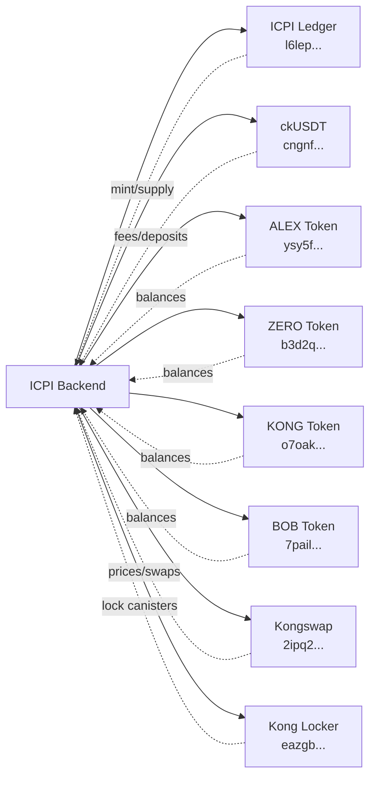

# ICPI Backend Security-First Refactoring Proposal

**Date:** 2025-10-06
**Author:** Security Analysis Team
**Status:** Draft
**Impact:** Major - Complete backend reorganization

---

## Part 1: Executive Summary

### Problem Statement
The current ICPI backend architecture mixes critical financial operations with informational queries, creating security audit challenges and maintenance difficulties. Code that affects real token balances is intermingled with display-only functions, making it difficult to apply appropriate security standards and testing rigor to different risk levels.

### Key Security Improvements
1. **Clear Security Boundaries** - Physically separate critical code that affects tokens from informational queries
2. **Audit Efficiency** - Security auditors can focus on clearly defined high-risk modules
3. **Developer Safety** - New developers immediately understand which code requires extreme caution
4. **Testing Standards** - Apply different testing rigor based on security classification
5. **Principle of Least Privilege** - Restrict access to critical functions through module boundaries

### High-Level Changes
- Reorganize 16 modules into 5 security-focused domains
- Separate "what SHOULD we hold" (external reference) from "what DO we hold" (internal state)
- Create clear boundaries between token-affecting operations and informational queries
- Establish different testing and review standards for different security levels

---

## Part 2: Current State Analysis

### 2.1 Critical Path Inventory

#### **Complete Token-Affecting Operations**

##### 1. MINTING PATH (`complete_mint` - minting.rs:105)
```
complete_mint() [CRITICAL - Creates new ICPI tokens]
├─> collect_fee() [icrc_types.rs:96] - Collects 0.1 ckUSDT fee
├─> get_icpi_total_supply() [ledger_client.rs:55] ⚠️ CRITICAL - Supply for ratio
├─> calculate_tvl_in_ckusdt() [tvl_calculator.rs:221] ⚠️ CRITICAL - TVL for ratio
│   ├─> query_icrc1_balance() [icrc_types.rs:210] - ckUSDT balance
│   ├─> get_token_balance() [balance_tracker.rs:13] - Each token balance (parallel)
│   └─> get_token_price_in_usdt() [kongswap.rs:50] - Each token price (parallel)
├─> collect_deposit() [icrc_types.rs:130] - Transfer ckUSDT from user
├─> multiply_and_divide() [precision.rs:8] - Calculate ICPI amount
└─> mint_icpi_tokens() [ledger_client.rs:9] ⚠️ CRITICAL - Mint on ledger
```

##### 2. BURNING PATH (`burn_icpi` - burning.rs:28)
```
burn_icpi() [CRITICAL - Burns ICPI, returns underlying tokens]
├─> collect_fee() [icrc_types.rs:96] - Collects 0.1 ckUSDT fee
├─> get_icpi_total_supply() [ledger_client.rs:55] ⚠️ CRITICAL - For proportions
├─> query_icrc1_balance() [icrc_types.rs:210] - ckUSDT balance
├─> get_token_balance() [balance_tracker.rs:13] ⚠️ CRITICAL - Each token (loop)
├─> multiply_and_divide() [precision.rs:8] - Calculate redemptions
└─> transfer_to_user() [icrc_types.rs:173] ⚠️ CRITICAL - Send tokens
```

##### 3. REBALANCING PATH (`perform_rebalance` - rebalancer.rs:56)
```
perform_rebalance() [CRITICAL - Executes portfolio trades]
├─> get_rebalancing_recommendation() [index_state.rs:243]
│   ├─> get_index_state() [index_state.rs:101]
│   │   ├─> get_current_positions() [balance_tracker.rs:67]
│   │   │   ├─> get_token_balance() [balance_tracker.rs:13] (parallel)
│   │   │   ├─> get_token_price_in_usdt() [kongswap.rs:50] (parallel)
│   │   │   └─> get_ckusdt_balance() [balance_tracker.rs:41]
│   │   ├─> calculate_target_allocations() [index_state.rs:12]
│   │   │   ├─> get_cached_or_calculate_tvl() [tvl_calculator.rs:180]
│   │   │   │   └─> calculate_locked_tvl() [tvl_calculator.rs:10]
│   │   │   │       ├─> get_all_lock_canisters() [kong_locker.rs:19]
│   │   │   │       └─> get_lp_positions() [kongswap.rs:13] (parallel)
│   │   │   └─> calculate_tvl_percentages() [tvl_calculator.rs:101]
│   │   └─> calculate_deviations() [index_state.rs:56]
│   └─> get_rebalancing_action() [index_state.rs:162]
└─> execute_swap() [kongswap.rs:108] ⚠️ CRITICAL - Actual trade
    ├─> swap_amounts() [kongswap - quote]
    ├─> approve_kongswap_spending() [icrc_types.rs:230] - If not ICP
    └─> swap() [kongswap - execute]
```

### 2.2 Security Impact Matrix

| Function | Module | Category | Used In | Financial Impact |
|----------|--------|----------|---------|------------------|
| **calculate_tvl_in_ckusdt** | tvl_calculator | **CRITICAL** | Minting | Wrong TVL = wrong mint ratio |
| **get_icpi_total_supply** | ledger_client | **CRITICAL** | Mint/Burn | Wrong supply = wrong proportions |
| **get_token_balance** | balance_tracker | **CRITICAL** | Burning | Wrong balance = wrong redemption |
| **execute_swap** | kongswap | **CRITICAL** | Rebalancing | Direct token trades |
| **mint_icpi_tokens** | ledger_client | **CRITICAL** | Minting | Creates new tokens |
| **transfer_to_user** | icrc_types | **CRITICAL** | Burning | Sends tokens to users |
| **approve_kongswap_spending** | icrc_types | **CRITICAL** | Rebalancing | Allows token spending |
| **multiply_and_divide** | precision | **CRITICAL** | Mint/Burn | Math errors = wrong amounts |
| **get_current_positions** | balance_tracker | **IMPORTANT** | Rebalancing | Portfolio state for decisions |
| **calculate_target_allocations** | index_state | **IMPORTANT** | Rebalancing | Target portfolio weights |
| **get_token_price_in_usdt** | kongswap | **IMPORTANT** | Multiple | Price errors affect calculations |
| **collect_fee** | icrc_types | **IMPORTANT** | Mint/Burn | Fee collection |
| **collect_deposit** | icrc_types | **IMPORTANT** | Minting | User deposit collection |
| **calculate_locked_tvl** | tvl_calculator | INFORMATIONAL | Display | Shows locked liquidity |
| **get_tvl_summary** | tvl_calculator | INFORMATIONAL | Frontend | Display only |
| **get_index_state_cached** | lib | INFORMATIONAL | Frontend | Cached display data |
| **get_rebalancer_status** | rebalancer | INFORMATIONAL | Frontend | Timer status |
| **get_all_lock_canisters** | kong_locker | INFRASTRUCTURE | TVL calc | External data fetch |
| **get_lp_positions** | kongswap | INFRASTRUCTURE | TVL calc | External data fetch |

### 2.3 Current Organization Problems

#### **Major Confusion Points**

1. **Two Different "TVL" Concepts**
   - `calculate_locked_tvl()` - External LP positions from kong_locker (for targets)
   - `calculate_tvl_in_ckusdt()` - ICPI's actual holdings (for mint calculations)
   - Both in same file (tvl_calculator.rs), serving completely different purposes

2. **Mixed Security Levels**
   - `balance_tracker.rs` contains both:
     - CRITICAL: `get_token_balance()` used in burning
     - INFORMATIONAL: `get_balance_summary()` for display

3. **Unclear Module Purposes**
   - `kongswap.rs` does three things:
     - LP position queries (informational)
     - Token pricing (important)
     - Swap execution (CRITICAL)

4. **Data Fetching Mixed with Business Logic**
   - `tvl_calculator.rs` both fetches data AND calculates percentages
   - `index_state.rs` queries balances AND determines rebalancing actions

#### **Security Risks**

1. **Hard to Audit** - Critical code scattered across 16 files
2. **Easy to Miss Critical Functions** - No clear boundaries
3. **Testing Confusion** - Which functions need exhaustive testing?
4. **Maintenance Risk** - Developers may not realize function criticality

### 2.4 Data Flow Analysis

#### **External Canister Dependencies**

| External Canister | Purpose | Functions Using It | Risk Level |
|-------------------|---------|-------------------|------------|
| ICPI Ledger (l6lep...) | Token supply/minting | mint_icpi_tokens, get_icpi_total_supply | CRITICAL |
| ckUSDT (cngnf...) | Fee/deposit collection | collect_fee, collect_deposit | CRITICAL |
| Tracked Tokens (4 canisters) | Balance queries | get_token_balance | CRITICAL |
| Kongswap (2ipq2...) | Trading/pricing | execute_swap, get_token_price | CRITICAL |
| Kong Locker (eazgb...) | Lock canister list | get_all_lock_canisters | LOW |

#### **Caching Strategies and Risks**

| Cached Data | TTL | Used In | Risk if Stale |
|-------------|-----|---------|---------------|
| Lock canisters | 1 hour | TVL calculation | Outdated targets (LOW) |
| TVL data | 5 minutes | Target allocations | Wrong rebalance targets (MEDIUM) |
| Index state | 5 minutes | Frontend display | Stale UI (LOW) |

#### **Race Condition Opportunities**

1. **Minting**: TVL calculated BEFORE deposit collected (MITIGATED - correct design)
2. **Burning**: Supply queried AFTER user burns (MITIGATED - atomic)
3. **Rebalancing**: Price could change between quote and execute (ACCEPTED - slippage protection)

---

## Part 3: Threat Model

### 3.1 Attack Vectors Identified

#### **Critical Paths**

1. **Mint Ratio Manipulation**
   - Attack: Manipulate TVL calculation during mint
   - Impact: User gets wrong amount of ICPI
   - Current Mitigation: TVL snapshot before deposit

2. **Burn Calculation Error**
   - Attack: Wrong balance queries during burn
   - Impact: User gets wrong redemption amount
   - Current Mitigation: Atomic operation

3. **Rebalancing Front-Running**
   - Attack: Front-run rebalance trades
   - Impact: Portfolio receives worse prices
   - Current Mitigation: Hourly execution, slippage limits

4. **Inter-Canister Call Failures**
   - Attack: DoS on external canisters
   - Impact: Operations fail
   - Current Mitigation: Error handling, refunds

### 3.2 Current Mitigations

1. **Two-Phase Minting** - Prevents race conditions
2. **Atomic Burning** - No state between burn and redemption
3. **Slippage Protection** - 2% max on rebalancing
4. **Refund Logic** - Returns deposits on failures
5. **Whitelist Validation** - Only approved canisters

### 3.3 Gaps to Address

1. **No rate limiting** on mint/burn operations
2. **No minimum time between rebalances** (beyond 1 hour)
3. **Cache poisoning** not considered
4. **Decimal precision** errors in f64 conversions
5. **No circuit breakers** for extreme market conditions

---

## Part 4: Proposed Architecture

### 4.1 New Directory Structure

```
src/icpi_backend/src/
├── critical_operations/         # ⚠️ HIGH SECURITY - Affects real tokens
│   ├── SECURITY.md             # Security requirements and audit checklist
│   ├── mod.rs
│   ├── minting/                # Mint operation orchestration
│   │   ├── mod.rs
│   │   ├── mint_orchestrator.rs    # complete_mint logic
│   │   ├── tvl_snapshot.rs         # calculate_tvl_in_ckusdt (for minting)
│   │   └── mint_calculations.rs    # multiply_and_divide for mint ratio
│   ├── burning/                # Burn operation orchestration
│   │   ├── mod.rs
│   │   ├── burn_orchestrator.rs    # burn_icpi logic
│   │   ├── redemption_calculator.rs # proportional calculations
│   │   └── token_transfers.rs      # transfer_to_user operations
│   └── trading/                # Rebalancing trades
│       ├── mod.rs
│       ├── swap_executor.rs        # execute_swap
│       ├── approval_manager.rs     # approve_kongswap_spending
│       └── price_validator.rs      # Validate prices before trades
│
├── portfolio_data/             # IMPORTANT - Current holdings data
│   ├── README.md              # "Queries actual token balances"
│   ├── mod.rs
│   ├── balance_queries.rs         # get_token_balance, get_ckusdt_balance
│   ├── position_tracker.rs        # get_current_positions
│   ├── portfolio_value.rs         # Total value calculations
│   └── balance_cache.rs           # Safe caching for non-critical uses
│
├── kong_liquidity/            # MEDIUM - External reference data
│   ├── README.md              # "Queries locked liquidity for targets"
│   ├── mod.rs
│   ├── locker_discovery.rs       # get_all_lock_canisters
│   ├── lp_positions.rs           # get_lp_positions
│   ├── target_calculator.rs      # calculate_target_allocations
│   └── tvl_aggregator.rs         # calculate_locked_tvl (rename from current)
│
├── market_data/               # MEDIUM - Pricing and market info
│   ├── mod.rs
│   ├── price_oracle.rs           # get_token_price_in_usdt
│   ├── swap_quoter.rs            # Get swap quotes from Kongswap
│   └── price_cache.rs            # Cache with TTL for non-critical uses
│
├── informational/            # LOW STAKES - Display only
│   ├── README.md             # "Safe for frontend queries, no token impact"
│   ├── mod.rs
│   ├── index_state_display.rs    # get_index_state_cached
│   ├── tvl_summary.rs            # get_tvl_summary
│   ├── rebalancer_status.rs      # get_rebalancer_status
│   ├── health_status.rs          # get_health_status
│   └── portfolio_formatter.rs    # Format data for UI
│
├── orchestration/            # Business logic coordination
│   ├── mod.rs
│   ├── rebalancer.rs             # Hourly rebalancing timer
│   ├── index_state.rs            # Combines data for decisions
│   └── deviation_analyzer.rs     # Calculate rebalancing needs
│
├── infrastructure/           # Supporting utilities
│   ├── mod.rs
│   ├── icrc_types.rs             # Token standard types
│   ├── precision_math.rs         # Safe math operations
│   ├── ledger_client.rs          # ICPI ledger interactions
│   ├── fee_collector.rs          # collect_fee operations
│   └── validators.rs             # Input validation
│
├── types/                    # Shared type definitions
│   ├── mod.rs
│   ├── tokens.rs                 # TrackedToken enum
│   ├── portfolio.rs              # CurrentPosition, TargetAllocation
│   ├── operations.rs             # MintStatus, BurnResult
│   └── external.rs               # Kongswap types
│
└── lib.rs                    # Public API endpoints
```

### 4.2 Module Responsibilities

#### **critical_operations/** - Highest Security
- **Purpose**: Contains ALL code that can mint, burn, or trade tokens
- **Security**: Requires 100% test coverage, formal verification where possible
- **Access**: Private modules, only exposed through controlled public functions
- **Testing**: Unit tests, integration tests, fuzzing, security audits
- **Review**: Any change requires 2+ senior developer reviews

#### **portfolio_data/** - Important Security
- **Purpose**: Query current token balances and portfolio state
- **Security**: Read-only operations but critical for calculations
- **Access**: Public read functions, no write operations
- **Testing**: Comprehensive unit tests, integration tests
- **Review**: Standard code review required

#### **kong_liquidity/** - Medium Security
- **Purpose**: Query external locked liquidity for target calculations
- **Security**: External data source, validate and sanitize
- **Access**: Public read functions
- **Testing**: Unit tests with mocked data
- **Review**: Standard review, focus on data validation

#### **market_data/** - Medium Security
- **Purpose**: Price queries and market information
- **Security**: Critical for trades but read-only
- **Access**: Public read functions with caching
- **Testing**: Unit tests with price validation
- **Review**: Focus on decimal precision and overflow

#### **informational/** - Low Security
- **Purpose**: Frontend display queries, no token impact
- **Security**: Can fail gracefully, cached data acceptable
- **Access**: Public query methods
- **Testing**: Basic unit tests
- **Review**: Quick review acceptable

### 4.3 Rationale for Each Decision

1. **critical_operations/minting/tvl_snapshot.rs**
   - Moved from: tvl_calculator.rs:221 (calculate_tvl_in_ckusdt)
   - Reason: Phase 1 analysis shows it's used in mint calculations where wrong TVL causes incorrect token issuance

2. **portfolio_data/balance_queries.rs**
   - Moved from: balance_tracker.rs:13 (get_token_balance)
   - Reason: Critical for burn calculations - wrong balance = wrong redemption

3. **kong_liquidity/tvl_aggregator.rs**
   - Moved from: tvl_calculator.rs:10 (calculate_locked_tvl)
   - Reason: External reference data for targets, not critical for token operations

4. **Split kongswap.rs into three modules:**
   - critical_operations/trading/ - Swap execution
   - market_data/ - Price queries
   - kong_liquidity/ - LP positions
   - Reason: Different security levels for different operations

---

## Part 5: Migration Strategy

### 5.1 Phased Approach

#### **Phase 1: Create New Structure (No Code Changes)**
```bash
# Create all new directories
mkdir -p src/icpi_backend/src/{critical_operations,portfolio_data,kong_liquidity}
mkdir -p src/icpi_backend/src/{market_data,informational,orchestration,infrastructure}

# Add README/SECURITY files
echo "# Critical Operations - HIGH SECURITY" > critical_operations/SECURITY.md
```
- Risk: None - just creating directories
- Validation: Directory structure exists

#### **Phase 2: Move Infrastructure (Lowest Risk)**
Move files that don't directly affect tokens:
1. Move `icrc_types.rs` → `infrastructure/icrc_types.rs`
2. Move `precision.rs` → `infrastructure/precision_math.rs`
3. Move `ledger_client.rs` → `infrastructure/ledger_client.rs`
4. Update imports in dependent files

- Risk: Low - these are utility functions
- Validation: All tests still pass

#### **Phase 3: Separate Informational Queries**
Extract display-only functions:
1. Create `informational/tvl_summary.rs` from `tvl_calculator::get_tvl_summary()`
2. Create `informational/rebalancer_status.rs` from `rebalancer::get_rebalancer_status()`
3. Move cached state queries to `informational/`

- Risk: Low - frontend only
- Validation: Frontend still displays correctly

#### **Phase 4: Split Critical Operations**
Carefully move token-affecting code:
1. Move minting operations to `critical_operations/minting/`
2. Move burning operations to `critical_operations/burning/`
3. Move swap execution to `critical_operations/trading/`

- Risk: High - requires careful testing
- Validation: Test each operation thoroughly

#### **Phase 5: Reorganize Data Queries**
Separate portfolio from external data:
1. Move balance queries to `portfolio_data/`
2. Move kong_locker queries to `kong_liquidity/`
3. Move price queries to `market_data/`

- Risk: Medium - affects calculations
- Validation: Rebalancing still works correctly

### 5.2 Risk Mitigation Per Phase

| Phase | Primary Risk | Mitigation Strategy | Rollback Plan |
|-------|-------------|-------------------|---------------|
| 1 | None | N/A | Delete directories |
| 2 | Import errors | Update all imports systematically | Git revert |
| 3 | Frontend breaks | Test each endpoint after move | Git revert |
| 4 | Token operations fail | Extensive testing on testnet | Git revert + hotfix |
| 5 | Rebalancing fails | Monitor first rebalance closely | Quick patch ready |

### 5.3 Verification Checklist

After each phase, verify:
- [ ] All unit tests pass
- [ ] Integration tests pass
- [ ] Can mint ICPI successfully
- [ ] Can burn ICPI successfully
- [ ] Rebalancing executes correctly
- [ ] Frontend displays correctly
- [ ] No performance degradation
- [ ] No new compiler warnings

---

## Part 6: Security Improvements

### 6.1 Architectural Security Benefits

1. **Clear Audit Boundaries**
   - Auditors focus on `critical_operations/` for high-risk code
   - Different security standards for different modules
   - Easier to verify complete coverage

2. **Principle of Least Privilege**
   - Critical functions not exposed publicly
   - Module boundaries enforce access control
   - Clear separation of concerns

3. **Developer Safety**
   - New developers see `critical_operations/` and know to be careful
   - Informational code clearly marked as low-risk
   - Less chance of accidental token loss

4. **Testing Efficiency**
   - Apply exhaustive testing only where needed
   - Quick iteration on informational code
   - Focus resources on critical paths

### 6.2 New Safeguards Enabled

1. **Module-Level Access Control**
```rust
// critical_operations/mod.rs
pub(crate) mod minting;  // Only accessible within critical_operations
pub use minting::initiate_mint;  // Controlled public exposure
```

2. **Mandatory Security Reviews**
```rust
// critical_operations/SECURITY.md
## Review Checklist
- [ ] No untrusted input used in calculations
- [ ] All decimal conversions verified
- [ ] Overflow protection in place
- [ ] Race conditions considered
```

3. **Different Error Handling**
```rust
// critical_operations/ - Must propagate all errors
Result<Nat, String>  // Never unwrap()

// informational/ - Can use defaults
unwrap_or_else(|_| cached_value)
```

---

## Part 7: Testing Strategy

### 7.1 Critical Path Tests

#### **Minting Tests Required**
```rust
#[test]
fn test_mint_ratio_calculation() { }
fn test_mint_with_zero_tvl() { }
fn test_mint_overflow_protection() { }
fn test_mint_decimal_precision() { }
fn test_mint_refund_on_failure() { }
```

#### **Burning Tests Required**
```rust
#[test]
fn test_burn_proportional_calculation() { }
fn test_burn_with_multiple_tokens() { }
fn test_burn_partial_transfer_failure() { }
fn test_burn_decimal_rounding() { }
```

#### **Rebalancing Tests Required**
```rust
#[test]
fn test_rebalance_buy_action() { }
fn test_rebalance_sell_action() { }
fn test_rebalance_slippage_protection() { }
fn test_rebalance_with_price_change() { }
```

### 7.2 Test Organization

```
tests/
├── critical/           # Must pass 100%
│   ├── test_minting.rs
│   ├── test_burning.rs
│   └── test_trading.rs
├── integration/        # End-to-end flows
│   ├── test_mint_burn_cycle.rs
│   └── test_rebalancing_cycle.rs
├── security/          # Security-specific
│   ├── test_overflow.rs
│   ├── test_precision.rs
│   └── test_race_conditions.rs
└── smoke/            # Quick validation
    └── test_basic_operations.rs
```

---

## Part 8: Implementation Guidance

### 8.1 File Migration Map

#### **Phase 2: Infrastructure**
```
precision.rs → infrastructure/precision_math.rs
icrc_types.rs → infrastructure/icrc_types.rs
ledger_client.rs → infrastructure/ledger_client.rs
```

#### **Phase 3: Informational**
```
tvl_calculator.rs:116 get_tvl_summary()
  → informational/tvl_summary.rs

rebalancer.rs:243 get_rebalancer_status()
  → informational/rebalancer_status.rs

lib.rs:73 get_index_state_cached()
  → informational/index_state_display.rs
```

#### **Phase 4: Critical Operations**
```
minting.rs:ALL
  → critical_operations/minting/mint_orchestrator.rs

burning.rs:ALL
  → critical_operations/burning/burn_orchestrator.rs

tvl_calculator.rs:221 calculate_tvl_in_ckusdt()
  → critical_operations/minting/tvl_snapshot.rs
  (Used in mint calculations - Phase 1 analysis)

kongswap.rs:108 execute_swap()
  → critical_operations/trading/swap_executor.rs

icrc_types.rs:230 approve_kongswap_spending()
  → critical_operations/trading/approval_manager.rs
```

#### **Phase 5: Data Queries**
```
balance_tracker.rs:13 get_token_balance()
  → portfolio_data/balance_queries.rs
  (Critical for burn calculations)

balance_tracker.rs:67 get_current_positions()
  → portfolio_data/position_tracker.rs

kong_locker.rs:ALL
  → kong_liquidity/locker_discovery.rs

kongswap.rs:13 get_lp_positions()
  → kong_liquidity/lp_positions.rs

kongswap.rs:50 get_token_price_in_usdt()
  → market_data/price_oracle.rs

tvl_calculator.rs:10 calculate_locked_tvl()
  → kong_liquidity/tvl_aggregator.rs
  (External reference, not critical)
```

### 8.2 Breaking Changes

#### **Import Path Changes**
```rust
// Old
use crate::tvl_calculator::calculate_tvl_in_ckusdt;

// New
use crate::critical_operations::minting::tvl_snapshot::calculate_tvl_in_ckusdt;
```

#### **Module Access Changes**
```rust
// Old - All public
pub async fn get_token_balance()

// New - Module visibility
pub(crate) async fn get_token_balance()  // Only within portfolio_data
pub use balance_queries::get_token_balance;  // Controlled exposure
```

#### **Function Name Changes**
```rust
// Rename for clarity
calculate_locked_tvl() → calculate_external_tvl_targets()
calculate_tvl_in_ckusdt() → calculate_portfolio_value_for_mint()
```

### 8.3 Code Review Requirements

| Module | Review Requirements | Reviewers Needed |
|--------|-------------------|------------------|
| critical_operations/ | Security audit + 2 senior devs | 3 |
| portfolio_data/ | Standard review + 1 senior dev | 2 |
| kong_liquidity/ | Standard review | 1 |
| market_data/ | Focus on precision | 1 |
| informational/ | Quick review | 1 |

---

## Part 9: Open Questions

### Decisions Requiring Human Judgment

1. **Naming Convention**
   - Should we use `kong_liquidity/` or `external_liquidity/`?
   - Should `portfolio_data/` be called `icpi_holdings/`?

2. **Module Granularity**
   - Should `collect_fee` and `collect_deposit` be in separate modules?
   - Should price queries have their own top-level module?

3. **Caching Strategy**
   - Should we have a centralized cache module?
   - Different TTLs for different security levels?

4. **Access Control**
   - Should critical operations require special capabilities?
   - How to enforce review requirements technically?

### Trade-offs to Consider

1. **Performance vs Security**
   - More module boundaries = more overhead
   - Benefit: Clear security boundaries
   - Cost: Slightly more complex imports

2. **Granularity vs Simplicity**
   - More modules = clearer purpose
   - Fewer modules = easier navigation

3. **Backward Compatibility**
   - Keep old function names as aliases?
   - Breaking changes for clarity?

---

## Part 10: Appendices

### Appendix A: Complete Critical Path Graphs

#### **Mint Operation - Full Dependency Tree**
```
initiate_mint(ckusdt_amount)
└─> complete_mint(mint_id)
    ├─> validate_mint_request()
    │   ├─> check_mint_exists()
    │   ├─> verify_ownership()
    │   └─> check_expiration()
    ├─> collect_fee(user)
    │   └─> icrc2_transfer_from(ckUSDT)
    ├─> calculate_mint_amount()
    │   ├─> get_icpi_total_supply()
    │   │   └─> call(ICPI_ledger, "icrc1_total_supply")
    │   ├─> calculate_tvl_in_ckusdt()
    │   │   ├─> query_icrc1_balance(ckUSDT)
    │   │   ├─> parallel:
    │   │   │   ├─> get_token_balance(ALEX)
    │   │   │   ├─> get_token_balance(ZERO)
    │   │   │   ├─> get_token_balance(KONG)
    │   │   │   └─> get_token_balance(BOB)
    │   │   └─> parallel:
    │   │       ├─> get_token_price_in_usdt(ALEX)
    │   │       ├─> get_token_price_in_usdt(ZERO)
    │   │       ├─> get_token_price_in_usdt(KONG)
    │   │       └─> get_token_price_in_usdt(BOB)
    │   └─> multiply_and_divide(deposit, supply, tvl)
    ├─> collect_deposit(user, amount)
    │   └─> icrc2_transfer_from(ckUSDT)
    └─> mint_icpi_tokens(user, icpi_amount)
        └─> icrc1_transfer(from: minting_account, to: user)
```

#### **Burn Operation - Full Dependency Tree**
```
burn_icpi(amount)
├─> validate_burn_amount()
├─> collect_fee(user)
│   └─> icrc2_transfer_from(ckUSDT)
├─> get_icpi_total_supply()
│   └─> call(ICPI_ledger, "icrc1_total_supply")
├─> calculate_redemptions()
│   ├─> query_icrc1_balance(ckUSDT)
│   ├─> sequential:
│   │   ├─> get_token_balance(ALEX)
│   │   ├─> get_token_balance(ZERO)
│   │   ├─> get_token_balance(KONG)
│   │   └─> get_token_balance(BOB)
│   └─> multiply_and_divide(amount, balance, supply) x5
└─> execute_redemptions()
    └─> sequential:
        ├─> transfer_to_user(ckUSDT, amount)
        ├─> transfer_to_user(ALEX, amount)
        ├─> transfer_to_user(ZERO, amount)
        ├─> transfer_to_user(KONG, amount)
        └─> transfer_to_user(BOB, amount)
```

### Appendix B: Complete Function Inventory

#### **Token-Affecting Functions (23 total)**
```
Critical (Direct Token Operations):
- mint_icpi_tokens()
- burn_icpi()
- execute_swap()
- transfer_to_user()
- approve_kongswap_spending()
- collect_fee()
- collect_deposit()

Important (Used in Calculations):
- get_icpi_total_supply()
- calculate_tvl_in_ckusdt()
- get_token_balance()
- get_ckusdt_balance()
- get_token_price_in_usdt()
- multiply_and_divide()
- calculate_proportional_amount()
- convert_decimals()

Supporting (Orchestration):
- complete_mint()
- initiate_mint()
- perform_rebalance()
- get_rebalancing_recommendation()
- get_index_state()
- calculate_target_allocations()
- calculate_deviations()
- get_rebalancing_action()
```

#### **Informational Functions (15 total)**
```
Display/UI:
- get_index_state_cached()
- get_tvl_summary()
- get_balance_summary()
- get_rebalancer_status()
- get_health_status()
- get_tracked_tokens()
- get_token_metadata()
- format_index_state()

Debugging/Admin:
- test_kong_locker_connection()
- test_kongswap_connection()
- test_balance_query()
- clear_all_caches()
- get_cache_stats()
- debug_rebalancer()
- trigger_manual_rebalance()
```

### Appendix C: External Dependencies Map



---

## Conclusion

This refactoring proposal addresses the critical security and maintainability issues in the ICPI backend by:

1. **Creating clear security boundaries** between code that affects tokens and informational queries
2. **Organizing modules by business domain** rather than technical patterns
3. **Establishing different testing and review standards** based on risk level
4. **Making the codebase self-documenting** through folder structure

The phased migration approach minimizes risk while allowing continuous operation. Each phase can be validated independently before proceeding to the next.

**Next Steps:**
1. Review and approve this proposal
2. Create feature branch for refactoring
3. Execute Phase 1 (directory structure)
4. Proceed through phases with careful testing
5. Deploy to testnet for validation
6. Deploy to mainnet after security review

**Estimated Timeline:** 2-3 weeks for complete refactoring and testing

---

*End of Proposal Document*