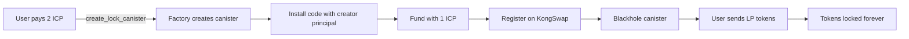

# Kong Locker - CLAUDE.md

**Context**: You are working on Kong Locker, a permanent liquidity locking service for KongSwap LP tokens on the Internet Computer.

## 🎯 Project Purpose

Kong Locker provides a trustless, immutable way to permanently lock KongSwap LP tokens. Users receive a unique "lock canister" that holds their LP tokens forever, serving as verifiable proof of long-term commitment for governance systems.

## 🏛️ Architecture Overview

### Two-Canister System

```
kong_locker (Factory)
├── Creates individual lock canisters
├── Maintains user→canister mappings
├── Handles payments and revenue sharing
└── Queries KongSwap for voting power

lock_canister (Individual)
├── Holds LP tokens permanently
├── No unlock mechanism (by design)
├── Immediately blackholed (no controllers)
└── Stores creator principal
```

### Key Design Principles
1. **Permanent Locking**: No unlock mechanism exists or will ever be added
2. **Trustless**: Canisters are blackholed immediately after creation
3. **Self-Contained**: Each lock canister operates independently
4. **Revenue Sharing**: Excess ICP automatically sent to alex_revshare

## 📁 Project Structure

```
kong_locker/
├── kong_locker/           # Factory canister (Rust)
│   ├── src/
│   │   ├── lib.rs        # Module exports and initialization
│   │   ├── types.rs      # KongSwap integration types
│   │   ├── storage.rs    # Stable storage and embedded WASM
│   │   ├── update.rs     # Canister creation and setup
│   │   ├── query.rs      # Voting power and status queries
│   │   └── revshare.rs   # Automatic revenue distribution
│   ├── kong_locker.did   # Auto-generated, DO NOT EDIT
│   └── Cargo.toml
│
├── lock_canister/         # Individual lock canister (Rust)
│   ├── src/
│   │   └── lib.rs        # Minimal logic: receive tokens, register
│   ├── lock_canister.did # Auto-generated, DO NOT EDIT
│   └── Cargo.toml
│
└── lp_locker_frontend/    # React frontend
    ├── src/
    │   ├── App.jsx
    │   └── components/
    ├── dist/             # Build output, DO NOT EDIT
    └── package.json
```

## 🔑 Core Concepts

### Lock Canister Lifecycle


### Payment Flow
- **2 ICP Required**: 1 ICP for KongSwap registration, 1 ICP for operations/revenue
- **Atomic Transaction**: Payment taken before canister creation
- **Revenue Sharing**: Excess ICP above reserve threshold sent to alex_revshare every 4 hours

### Voting Power Calculation
- Queries KongSwap's `user_balances` API
- Calculates USD value of all LP positions
- Returns value * 100 (preserving 2 decimal places as Nat)

## 💻 Development Workflow

### Building the Canisters

```bash
# Build lock_canister FIRST (embedded in factory)
cargo build --target wasm32-unknown-unknown --release -p lock_canister --locked

# Extract candid for lock_canister
candid-extractor target/wasm32-unknown-unknown/release/lock_canister.wasm > src/kong_locker/lock_canister/lock_canister.did

# Build kong_locker (embeds lock_canister WASM)
cargo build --target wasm32-unknown-unknown --release -p kong_locker --locked

# Extract candid for kong_locker
candid-extractor target/wasm32-unknown-unknown/release/kong_locker.wasm > src/kong_locker/kong_locker/kong_locker.did
```

### Deployment

```bash
# Deploy to mainnet (Claude can do this)
dfx identity use daopad
./deploy.sh --network ic --backend-only

# Deploy frontend only
./deploy.sh --network ic --frontend-only
```

### Testing Commands

```bash
# Create a lock canister (requires 2 ICP approval)
dfx canister --network ic call kong_locker create_lock_canister

# Check your lock canister
dfx canister --network ic call kong_locker get_my_lock_canister

# Get all lock canisters
dfx canister --network ic call kong_locker get_all_lock_canisters

# Get total positions count
dfx canister --network ic call kong_locker get_total_positions_count

# Check canister status
dfx canister --network ic call kong_locker get_detailed_canister_status

# Get creator of a lock canister
dfx canister --network ic call LOCK_CANISTER_ID get_creator

# Query LP positions directly from KongSwap (not Kong Locker)
dfx canister --network ic call 2ipq2-uqaaa-aaaar-qailq-cai user_balances '("LOCK_CANISTER_PRINCIPAL")'
```

## 🔐 Security Model

### Immutability Guarantees
```rust
// ✅ ALLOWED Operations
- Create lock canister
- Query positions and voting power
- Receive LP tokens

// ❌ FORBIDDEN Operations (NEVER implement)
- Unlock or withdraw tokens
- Transfer lock ownership
- Modify locked amounts
- Upgrade lock canisters
```

### Blackholing Process
1. Factory creates canister with itself as controller
2. Installs code and configures canister
3. Removes all controllers (blackholes)
4. Canister becomes permanently immutable

### Trust Assumptions
- Factory canister is trusted until lock canisters are created
- Once blackholed, lock canisters need zero trust
- KongSwap API is trusted for balance queries
- No admin functions or backdoors exist

## 🏗️ Query Architecture

Kong Locker follows a **lean architecture** where:
1. **Backend only stores** user→lock canister mappings
2. **LP balance data** is queried directly from KongSwap by the frontend
3. **No inter-canister calls** for balance queries (removed for efficiency)

### Frontend Integration Pattern

```typescript
// Step 1: Get lock canister from Kong Locker
const lockCanister = await kongLocker.get_my_lock_canister();

// Step 2: Query KongSwap directly for LP positions
const positions = await kongSwap.user_balances(lockCanister.toText());

// Step 3: Calculate voting power client-side
const votingPower = positions.reduce((sum, p) => sum + p.usd_balance * 100, 0);
```

### Benefits of Direct Queries

| Aspect | Old (Inter-canister) | New (Direct) |
|--------|---------------------|-------------|
| Query Type | Update calls | Query calls |
| Cost | ~13M cycles per call | Free |
| Speed | Sequential, 2-5s | Parallel, <500ms |
| Data Detail | USD totals only | Full LP pool breakdown |
| Backend Complexity | High | Low (simple storage) |

## 🔗 External Integrations

### KongSwap (2ipq2-uqaaa-aaaar-qailq-cai)
- **user_balances**: Query LP token positions (now called directly from frontend)
- **swap**: Convert ICP to ALEX for registration
- **Transfer**: Users send LP tokens to lock canisters

**Note**: As of the latest refactor, Kong Locker no longer makes inter-canister calls to KongSwap for balance queries. The frontend queries KongSwap directly for better performance and detailed LP pool breakdowns.

### ICP Ledger (ryjl3-tyaaa-aaaaa-aaaba-cai)
- **icrc2_transfer_from**: Take payment from users
- **icrc1_transfer**: Fund lock canisters
- **icrc1_balance_of**: Check balances

### Alex Revshare (e454q-riaaa-aaaap-qqcyq-cai)
- Receives excess ICP every 4 hours
- Distributes to ALEX stakers

## ⚠️ Critical Rules

1. **NEVER add unlock functionality** - Permanence is the core feature
2. **ALWAYS blackhole lock canisters** - No exceptions
3. **ALWAYS extract candid after Rust changes** - Keep interfaces in sync
4. **NEVER modify lock_canister after deployment** - It must remain immutable
5. **ALWAYS build lock_canister before kong_locker** - Factory embeds the WASM

## 🔴 Common Issues & Solutions

| Issue | Cause | Solution |
|-------|-------|----------|
| "You already have a lock canister" | User trying to create second | Use existing canister |
| "Payment failed" | No ICP approval | User must approve 2 ICP first |
| "User not found" | Not registered on KongSwap | Call register_if_funded with 1 ICP |
| "Insufficient ICP" | Lock canister needs funding | Send 1+ ICP to canister |
| Build fails | Wrong build order | Build lock_canister first, then kong_locker |
| Candid mismatch | Forgot to extract | Run candid-extractor after changes |

## 📊 Data Structures

### Factory Storage
```rust
// Stable BTreeMap: user principal → lock canister principal
USER_LOCK_CANISTERS: StableBTreeMap<StorablePrincipal, StorablePrincipal>

// Embedded at compile time
LOCK_CANISTER_WASM: &[u8] = include_bytes!("../lock_canister.wasm")
```

### Lock Canister Storage
```rust
// Creator principal (set once at init, never changed)
CREATOR: RefCell<Principal>
```

### KongSwap Types
```rust
struct LPReply {
    symbol: String,         // LP token symbol
    balance: f64,          // LP token balance
    usd_balance: f64,      // Total USD value
    symbol_0: String,      // First token
    amount_0: f64,         // First token amount
    symbol_1: String,      // Second token
    amount_1: f64,         // Second token amount
}
```

## 🚀 Deployment Checklist

When deploying changes:
- [ ] Build lock_canister first
- [ ] Extract lock_canister candid
- [ ] Build kong_locker (embeds WASM)
- [ ] Extract kong_locker candid
- [ ] Test locally if needed
- [ ] Deploy with `./deploy.sh --network ic`
- [ ] Verify with query commands

## 📈 Monitoring

```bash
# System health
dfx canister --network ic call kong_locker get_total_positions_count
dfx canister --network ic call kong_locker get_total_value_locked

# Individual canister
dfx canister --network ic call kong_locker get_detailed_canister_status

# All voting powers
dfx canister --network ic call kong_locker get_all_voting_powers
```

## 🔄 Recovery Procedures

### Incomplete Canister Setup
If a canister creation partially fails:
```bash
# User can complete setup themselves
dfx canister --network ic call kong_locker complete_my_canister_setup
```

This will:
1. Install code if missing
2. Fund with ICP if needed
3. Register on KongSwap
4. Blackhole the canister

## For Claude Code

When working on Kong Locker:
1. **Maintain simplicity** - This is a lock-only service, no complex features
2. **Never add unlock** - Users must understand tokens are locked forever
3. **Build order matters** - Always lock_canister before kong_locker
4. **Extract candid** - After every Rust change
5. **Test queries** - Most operations require update calls due to IC limitations
6. **Respect immutability** - Once deployed and blackholed, that's it

Remember: The beauty of this system is its simplicity. LP tokens go in, they never come out, and that's the entire point.