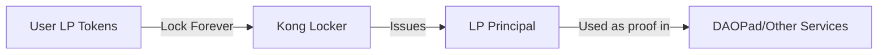

# Kong Locker - CLAUDE.md

**Context**: You are working on Kong Locker, a specialized service for permanently locking KongSwap liquidity positions to create verifiable proof of commitment.

## 🎯 Project Mission

Provide a simple, immutable service where users lock their KongSwap LP tokens permanently and receive a unique principal that represents their locked liquidity. This principal serves as proof of commitment for governance systems like DAOPad.

## 🏛️ Architecture

### Core Components

```
kong_locker/
├── lp_locking/           # Rust canister - LP token management
│   ├── src/
│   │   ├── lib.rs       # Main canister logic
│   │   ├── kong_integration.rs  # KongSwap API integration
│   │   └── types.rs     # LP position types
│   └── lp_locking.did   # Candid interface (auto-generated)
│
└── lp_locker_frontend/   # React app - LP position viewer
    ├── src/
    │   ├── App.jsx      # Main application
    │   └── components/  # UI components
    └── dist/            # Build output (DO NOT EDIT)
```

## 🔑 Key Concepts

### What is Kong Locker?
- **Purpose**: Lock LP tokens permanently (no unlock mechanism)
- **Output**: Unique principal representing locked liquidity
- **Website**: konglocker.org
- **Design Philosophy**: Simple, immutable, trustless

### LP Token Flow


### Why Permanent Locking?
- Prevents gaming the system
- Creates genuine long-term commitment
- Simplifies the architecture (no unlock logic)
- Makes the service truly trustless

## 💎 Core Functionality

### Backend Methods
```rust
// Primary Operations
lock_lp_tokens(amount: Nat, pool_id: Text) -> Result<Principal>
get_locked_position(principal: Principal) -> Result<LockedPosition>
get_all_voting_powers() -> Vec<(Principal, Nat)>

// KongSwap Integration
query_kong_pool(pool_id: Text) -> Result<PoolInfo>
verify_lp_ownership(user: Principal, amount: Nat) -> Result<bool>

// Statistics
get_total_locked_value() -> Result<Nat>
get_lock_count() -> Result<u64>
get_top_lockers(limit: usize) -> Vec<LockedPosition>
```

### Data Structure
```rust
struct LockedPosition {
    owner: Principal,           // Original owner who locked
    lp_principal: Principal,    // Unique principal issued
    amount: Nat,               // Amount of LP tokens locked
    pool_id: Text,            // KongSwap pool identifier
    locked_at: u64,           // Timestamp of lock
    token_0: TokenInfo,       // First token in pair
    token_1: TokenInfo,       // Second token in pair
    usd_value: Option<Nat>,   // USD value at lock time
}

struct TokenInfo {
    symbol: Text,
    canister_id: Principal,
    decimals: u8,
}
```

## 🔗 KongSwap Integration

### Pool Queries
```rust
// Get pool information from KongSwap
async fn get_pool_info(pool_id: &str) -> Result<PoolInfo> {
    let kong_swap = Principal::from_text(KONGSWAP_CANISTER)?;
    kong_swap.get_pool(pool_id).await
}
```

### LP Token Verification
```rust
// Verify user owns the LP tokens before locking
async fn verify_ownership(user: Principal, amount: Nat) -> Result<bool> {
    // Check balance on KongSwap
    // Verify approval for transfer
    // Return verification status
}
```

## 🛠️ Development Workflow

### Backend Changes
```bash
# 1. Make Rust changes
vim lp_locking/src/lib.rs

# 2. Build
cargo build --target wasm32-unknown-unknown --release -p lp_locking --locked

# 3. CRITICAL: Regenerate candid
candid-extractor target/wasm32-unknown-unknown/release/lp_locking.wasm > lp_locking/lp_locking.did

# 4. Ask user to deploy
echo "Please run: ./deploy.sh --network ic --backend-only"
```

### Frontend Development
```bash
# 1. Start dev server
cd lp_locker_frontend
npm install
npm run start  # Opens at localhost:3001

# 2. After changes, ask user to deploy
echo "Please run: ./deploy.sh --network ic --frontend-only"
```

## 📊 Frontend Features

### Main Views
- **Home**: Statistics dashboard (total locked, number of positions)
- **Lock**: Interface to lock LP tokens
- **Positions**: View all locked positions
- **Leaderboard**: Top lockers by value

### User Flow
1. Connect wallet
2. Select KongSwap LP tokens to lock
3. Approve transfer
4. Confirm permanent lock (with warnings!)
5. Receive LP principal
6. Copy principal for use in DAOPad

## ⚠️ Important Constraints

### Immutability Rules
```rust
// ❌ NEVER IMPLEMENT
fn unlock_tokens() { /* FORBIDDEN */ }
fn transfer_locked_position() { /* FORBIDDEN */ }
fn modify_locked_amount() { /* FORBIDDEN */ }

// ✅ ONLY THESE OPERATIONS
fn lock_tokens() { /* CREATE only */ }
fn get_position() { /* READ only */ }
```

### Security Considerations
- **No admin functions**: Canister is fully autonomous
- **No upgrades after stable**: Lock mechanism must be immutable
- **No backdoors**: Not even for emergencies
- **Verify everything**: Always verify LP token ownership before locking

## 🔴 Common Issues

| Issue | Cause | Solution |
|-------|-------|----------|
| "LP tokens not found" | Wrong pool ID | Verify pool exists on KongSwap |
| "Transfer failed" | No approval | User must approve token transfer first |
| "Invalid principal" | Format error | Check Principal.from_text() format |
| "Position not found" | Wrong principal | Use correct LP principal, not user principal |

## 🚨 Testing Checklist

When modifying Kong Locker:
- [ ] Verify LP token locking works
- [ ] Check principal generation is unique
- [ ] Test KongSwap integration
- [ ] Ensure no unlock mechanism exists
- [ ] Validate voting power calculations
- [ ] Test frontend displays positions correctly

## 📈 Monitoring

### Key Metrics
```rust
struct SystemStats {
    total_positions: u64,
    total_value_locked: Nat,
    unique_pools: u32,
    average_lock_size: Nat,
    largest_position: Nat,
}
```

### Health Checks
```bash
# Check system health
dfx canister --network ic call lp_locking get_stats

# Verify KongSwap connection
dfx canister --network ic call lp_locking ping_kongswap

# Get recent locks
dfx canister --network ic call lp_locking get_recent_locks '(10)'
```

## 🔗 Integration with DAOPad

Kong Locker provides the LP principals that DAOPad uses for governance:

```rust
// In DAOPad
register_with_lp_principal(lp_principal: Principal) {
    // Query Kong Locker for position details
    let position = kong_locker.get_locked_position(lp_principal)?;
    // Grant voting power based on locked amount
    grant_voting_power(user, position.amount);
}
```

## 📚 Resources

- [KongSwap Documentation](https://kongswap.io/docs)
- [IC Principal Spec](https://internetcomputer.org/docs/current/references/id-encoding-spec)
- [Token Standards](https://github.com/dfinity/ICRC-1)

## For Claude Code

When working on Kong Locker:
1. **Maintain simplicity** - This is a lock-only service
2. **Never add unlock** - Permanence is the core feature
3. **Verify everything** - Always check token ownership
4. **Focus on reliability** - This handles real value
5. **Update candid** - ALWAYS after Rust changes