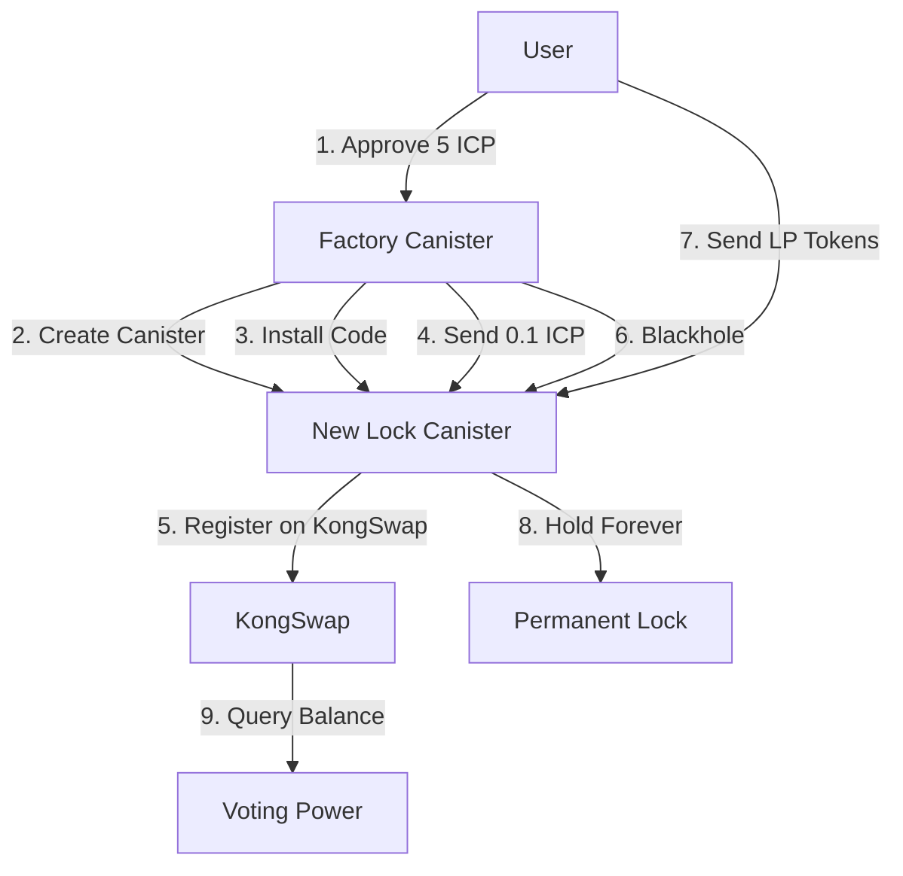

# Kong Locker Codebase Overview

## 🏗️ Architecture Summary

Kong Locker is a two-canister system for permanently locking KongSwap LP tokens:
1. **Factory Canister** (`lp_locking`) - Creates and tracks lock canisters
2. **Lock Canisters** (`lock_canister`) - Individual blackholed canisters that hold LP tokens

## 📁 Project Structure

```
kong_locker/
├── lp_locking/          # Factory canister (manages lock canisters)
├── lock_canister/       # Template for individual lock canisters
└── lp_locker_frontend/ # React frontend
```

## 🔧 Backend Components

### Factory Canister (`lp_locking/`)

#### **lib.rs** - Entry Point
- Module declarations and exports
- Exposes public canister methods
- Generates candid interface

#### **types.rs** - Data Structures
- **ICRC Token Types**: Transfer arguments and error types
- **KongSwap Types**: User balance queries and LP token info
- **LP Reply Structure**: Contains token pairs, balances, USD values

#### **storage.rs** - Persistent Storage
- **Memory Management**: Stable structures for data persistence
- **User Mappings**: Maps user principals to their lock canisters
- **WASM Embedding**: Contains compiled lock_canister code

#### **update.rs** - State-Changing Operations
```yaml
create_lock_canister():
  1. Verify user doesn't have existing canister
  2. Take 5 ICP payment (requires prior approval)
  3. Create new canister with factory as controller
  4. Install lock_canister WASM code
  5. Send 0.1 ICP to canister for registration
  6. Trigger KongSwap registration
  7. Blackhole canister (remove all controllers)
  8. Store user→canister mapping
```

#### **query.rs** - Read Operations
- `get_my_lock_canister()` - Returns caller's lock canister
- `get_all_lock_canisters()` - Lists all user→canister mappings
- `get_voting_power(user)` - Queries KongSwap for LP balance value

### Lock Canister (`lock_canister/`)

#### **lib.rs** - Minimal Functionality
```yaml
register_if_funded():
  - Check ICP balance (needs 0.1+ ICP)
  - Transfer ICP to KongSwap
  - Swap ICP→ALEX to register account
  - Returns success/error status

get_principal():
  - Returns canister's principal ID

INTENTIONALLY MISSING:
  - No transfer functions
  - No unlock mechanism
  - No admin functions
  - No upgrade capability
```

## 🎨 Frontend Components

### Main Components

#### **LPLockerDashboard.jsx**
- Central dashboard interface
- Displays voting power and lock status
- Shows quick stats banner
- Manages modal states
- Links to KongSwap

#### **LockCanisterStatus.jsx**
- Lock canister creation flow
- Displays canister address
- Registration status tracking
- Fund & register buttons
- Status checking functionality

#### **LPTransferGuide.jsx**
- Step-by-step transfer instructions
- KongSwap integration guide
- Visual feedback for transfers

### Service Layer

#### **lpLockerService.js**
```javascript
Core Functions:
- createLockCanister()     // Creates new lock canister
- getMyLockCanister()      // Fetches user's canister
- fundLockCanister()       // Sends ICP to canister
- registerLockCanister()   // Triggers KongSwap registration
- checkLockCanisterStatus()// Verifies ICP balance
- getVotingPower()         // Queries LP value
```

### State Management

#### **lpLockerSlice.js**
- Redux state for lock canister info
- Loading and error states
- ICP balance tracking
- Voting power storage

#### **lpLockerThunks.js**
- Async action creators
- Complex workflows (create→fund→register)
- Error handling
- State updates

## 🔄 User Flow



## 💰 Economics

### Creation Cost Breakdown
- **User Pays**: 5 ICP total
- **KongSwap Registration**: 0.1 ICP
- **Factory Retains**: 4.9 ICP for operations
- **Cycles**: 800B cycles for canister creation

### Operational Model
- One-time payment per user
- No ongoing fees
- Factory self-sustaining through creation fees
- Lock canisters operate autonomously

## 🔒 Security Architecture

### Immutability Guarantees
1. **Blackholed**: No controllers after creation
2. **No Upgrades**: Code cannot be modified
3. **No Backdoors**: No admin or emergency functions
4. **Permanent Lock**: No unlock mechanism exists

### Trust Model
- **Trustless**: No party can retrieve locked tokens
- **Verifiable**: All code is open source
- **Autonomous**: Canisters operate independently
- **Transparent**: All locks visible on-chain

## 🔑 Key Design Decisions

### Why Permanent Locking?
- Prevents gaming the system
- Creates genuine long-term commitment
- Simplifies architecture (no unlock logic)
- Ensures true trustlessness

### Why Individual Canisters?
- Clear ownership model
- Isolated risk per user
- Simple principal-based identification
- Direct KongSwap integration

### Why 5 ICP Fee?
- Covers canister creation costs
- Funds KongSwap registration
- Sustains factory operations
- Prevents spam creation

## 📊 Data Flow

```yaml
Voting Power Calculation:
  1. User registers with DAOPad using lock canister principal
  2. DAOPad queries factory for voting power
  3. Factory queries KongSwap for LP balance
  4. KongSwap returns USD value of LP position
  5. Factory returns voting power (USD * 100)
  6. DAOPad grants governance rights
```

## ⚠️ Important Constraints

### Cannot Be Changed
- Lock permanence (no unlock ever)
- Blackhole status (no controllers)
- Code immutability (no upgrades)
- Fee structure (5 ICP requirement)

### Technical Limitations
- Inter-canister query calls don't work (IC limitation)
- Must use update calls for cross-canister reads
- Cycles management requires careful monitoring
- WASM size limits for embedded code

## 🚀 Deployment

### Build Process
```bash
# Build lock canister first (embedded in factory)
cargo build --target wasm32-unknown-unknown --release -p lock_canister

# Then build factory
cargo build --target wasm32-unknown-unknown --release -p lp_locking

# Extract candid interfaces
candid-extractor target/wasm32-unknown-unknown/release/lp_locking.wasm > lp_locking/lp_locking.did
```

### Canister IDs (Mainnet)
- **Factory**: `7zv6y-5qaaa-aaaar-qbviq-cai`
- **Frontend**: `c6w56-taaaa-aaaai-atlma-cai`
- **Lock Canisters**: Dynamically created per user

## 📈 Future Considerations

### Potential Enhancements
- Batch lock canister creation
- Analytics dashboard
- Multiple LP token types
- Cross-chain integration

### Never Implement
- ❌ Unlock functionality
- ❌ Transfer mechanisms
- ❌ Admin overrides
- ❌ Emergency withdrawals